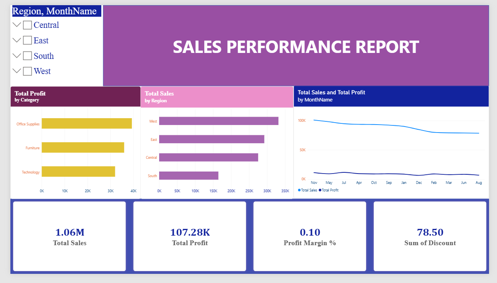

# Executive Sales Performance & Customer Insights Dashboard



## 📌 Project Overview
This project delivers an end-to-end business intelligence solution to analyze retail sales performance, gross revenue, net profit margins, and regional growth trends. Raw transaction records were structured into an optimized **Star Schema** within Power BI Desktop, utilizing custom **DAX time-intelligence measures** and interactive visual layouts to uncover margin leakages and optimize product discounting.

---

## 🛠️ Tech Stack & Architecture
* **Business Intelligence Tool:** Microsoft Power BI Desktop
* **Database & Querying:** MySQL / SQL
* **Data Cleansing & Transformation:** Power Query (M-Code), Python (Pandas)
* **Analytical Modeling:** DAX (Data Analysis Expressions), Star Schema

---

## 🏗️ Data Model & Star Schema Architecture
The report decouples transactional data from analytical dimensions to ensure high query performance and modular scaling:
* **Fact Table (`fact_sales`):** Contains operational measures (`Sales`, `Profit`, `Discount`) linked by transactional foreign keys (`OrderID`, `OrderDate`, `CustomerID`).
* **Dimension Table (`Dim_Date`):** Generated dynamically using DAX time-intelligence functions to handle calendar hierarchies (Year, Quarter, Month, MonthNumber).
* **Relationship:** One-to-Many (`1 : *`) relationship between `Dim_Date[Date]` and `fact_sales[OrderDate]`.

---

## 📐 Key DAX Measures Implemented

### 1. Total Sales
```dax
Total Sales = SUM(fact_sales[Sales])

**###2.net profit**
Total Profit = SUM(fact_sales[Profit])

**###3.gross profit margine**
Profit Margin % = DIVIDE([Total Profit], [Total Sales], 0)

**###4.perior month sales**
Sales PM = CALCULATE([Total Sales], PREVIOUSMONTH('Dim_Date'[Date]))

**###5.month over month**
MoM Sales Growth % = DIVIDE([Total Sales] - [Sales PM], [Sales PM], 0)


[https://github.com/Gangoli2005/Sales-Performance-Customer-Insights-Dashboard](https://github.com/Gangoli2005/Sales-Performance-Customer-Insights-Dashboard)

